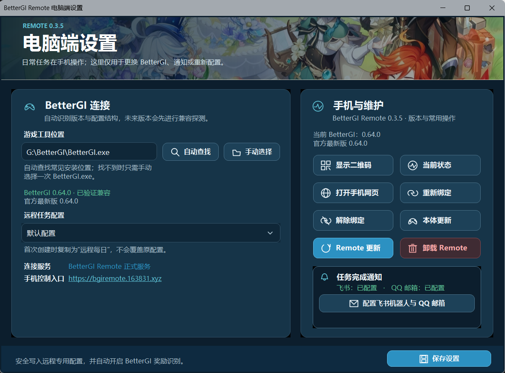
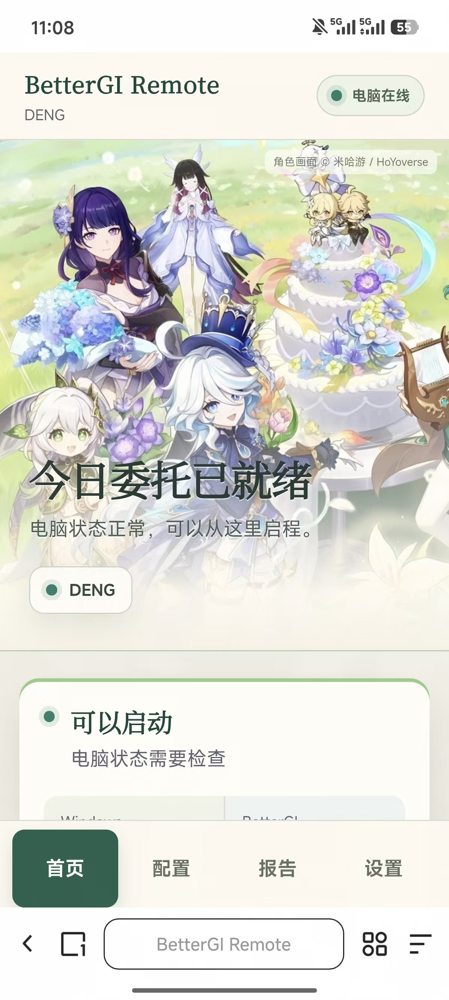

# BetterGI Remote

[](https://github.com/Denght123/bettergi_remote/actions/workflows/ci.yml)
[](https://github.com/Denght123/bettergi_remote/releases/latest)
[](LICENSE)

BetterGI Remote 是一个轻量、无账号的 BetterGI 手机远程控制工具。电脑安装一次并扫码绑定后，日常只需从手机打开控制页面，即可调整远程专用的一条龙配置、启动或停止任务并查看执行报告。

本项目不修改 BetterGI，也不会把 BetterGI 配置、任务、日志、飞书地址或解密密钥保存到中转服务器。

```text
手机 PWA 网页 ← HTTPS/WSS + 端到端加密 → 轻量中转服务
                                              ↕
                                      Windows 托盘小助手
                                              ↕
                                  BetterGI 配置文件与官方命令行
```

## 界面展示

### 电脑端设置



### 手机端控制页

<p align="center">
  
</p>

## 下载

当前版本：**v0.3.5**

- [从 BetterGI Remote 服务下载 Windows 安装包](https://bgiremote.163831.xyz/downloads/BetterGI.Remote.Setup.0.3.5.exe)
- [GitHub Release 备用下载](https://github.com/Denght123/bettergi_remote/releases/latest/download/BetterGI.Remote.Setup.0.3.5.exe)
- SHA-256：`93d0bcaf680432d2464b8c1c150685834dd59119357c959eb6b7a461669e2371`
- 手机控制入口：[https://bgiremote.163831.xyz](https://bgiremote.163831.xyz)

安装包目前没有购买商业代码签名证书，因此 Windows SmartScreen 可能显示“Windows 已保护你的电脑”。请确认文件来自本仓库 Release，并核对 SHA-256；然后点击“更多信息”→“仍要运行”。

## 使用条件

- Windows 10/11 x64。
- 官方 BetterGI 0.64.x，或通过配置结构兼容探测的更高版本。
- 电脑已开机、Windows 已登录且未锁屏。
- 开始任务和保存配置前，BetterGI 必须处于关闭状态。
- 手机使用现代 Android/iPhone 浏览器，微信内置浏览器也可用于首次扫码。

## 三步开始使用

1. 在电脑上下载安装 BetterGI Remote，完成安装后打开首次设置向导。
2. 确认自动识别的 BetterGI 目录；未识别时手动选择 `BetterGI.exe`。小助手会建立独立的“远程每日”配置，不修改你平时使用的一条龙配置。
3. 用手机扫描二维码，并在电脑弹窗中确认绑定。绑定完成后建议把控制页面添加到手机主屏幕，或发送到微信“文件传输助手”/收藏，之后无需再次扫码。

一台电脑同时只绑定一个手机浏览器。绑定有效期为 180 天，剩余 30 天内只要手机成功连接就会自动续期 180 天，剩余 14 天开始提醒。只要没有清除浏览器网站数据、重装电脑端或主动解除/重新绑定，日常使用通常不需要再次扫码。重新绑定会立即使旧手机失效。

Windows 小助手会在当前用户登录后自动启动并驻留系统托盘。它负责安全地读写 BetterGI 配置、执行官方启动命令、监视日志和发送报告；网页本身受浏览器安全限制，无法直接操作电脑上的 BetterGI。

## 手机端功能

- 查看电脑在线、Windows 锁定、BetterGI、原神和当前任务状态。
- 修改任务开关、拖动排序、保存配置。
- 点击“立即同步”读取电脑端源一条龙配置；电脑新增任务后会安全合并到远程配置末尾，未知任务仍只允许开关和排序。
- 启动当前“远程每日”一条龙任务。
- 通过预先设定的 BetterGI 取消快捷键停止远程任务。
- 查看任务进度、最近执行结果、识别到的奖励和错误信息。
- 任务完成后由电脑直接发送飞书自定义机器人和/或 QQ 邮箱通知（可选，通知凭据不经过中转服务器）。
- 查看手机绑定到期时间、PWA 版本和电脑端版本。

目前已实机验证 BetterGI 0.64.x 的八项官方一条龙任务；更高版本会先通过配置结构探测再决定是否允许运行：

- 领取邮件
- 合成树脂
- 自动秘境
- 自动首领讨伐
- 自动幽境危战
- 自动地脉花
- 领取每日奖励
- 领取尘歌壶奖励

已有自定义调度器配置组支持开关和排序，但手机不能新增、删除或修改组内脚本。

## v0.3.0 新增

- 手机绑定改为 180 天可续期租约，并提供临近到期、过期提示。
- 托盘菜单始终提供二维码、重新绑定、解除绑定、固定手机入口和当前状态。
- 新增 QQ 邮箱 SMTP 通知；桌面设置中的 `ⓘ` 会说明飞书 Webhook、签名密钥和 QQ SMTP 授权码的获取位置。
- “立即同步”可发现电脑源配置中新增加的一条龙任务。
- Windows 客户端可检查 GitHub Releases，校验安装包 SHA-256 后直接升级；任务运行中不会安装更新。
- 手机端和桌面端采用新的幻想冒险视觉，并针对手机使用独立多角色构图。

## v0.3.2 界面与维护功能

- 手机端换用用户提供的春日群像和派蒙图片，整体改为草木绿、湖蓝、淡紫与奶油白色系。
- 电脑设置页直接展示二维码、状态、网页入口、重新绑定、解除绑定和检查更新按钮。
- 新增“卸载 BetterGI Remote”按钮，确认后调用安装目录中的官方卸载向导；电脑配置和绑定数据默认保留。

## v0.3.3 自适配与奖励报告

- Windows 设置页升级为深色双栏控制台，统一线性图标、按钮、输入框、危险操作层级与原生悬停/按压过渡；修正控件基线并在折叠状态移除突兀滚动条。
- 新增 BetterGI 官方版本检查、托盘提醒和手机端更新提示；0.64.x 保持已验证兼容，更高版本会执行配置结构兼容探测。
- 保存设置时自动启用 BetterGI 奖励识别；任务报告新增“本次任务获得”和按电脑本地日期统计的“今日累计获得”。
- 奖励识别失败或部分失败会明确提示，避免把不完整统计误认为完整结果。

## v0.3.4 更新连接修复

- 修复部分网络环境无法直连 `github.com:443` 时，“检查更新”直接失败的问题。
- Remote 更新检查和安装包下载现在优先使用 `bgiremote.163831.xyz`，继续以 SHA-256 校验安装包；GitHub 仅作为备用检查源。
- BetterGI 官方版本检查改由 VPS 代查并短时缓存，电脑端无需直接访问 GitHub API。
- 安装包下载支持瞬时网络错误自动重试，并提供更明确的手动恢复提示。

## v0.3.5 电脑端界面精修

- 放大并统一电脑端线性图标，重新整理双栏宽度、按钮间距和通知配置入口。
- 飞书机器人与 QQ 邮箱状态固定显示在首屏，并优先展示相关通知配置。
- 输入框、下拉框和箭头改为统一深色自绘样式，修复高 DPI 下的白边、白色方块、文字裁切和错位。
- 设置页启用合成双缓冲滚动，减少展开通知设置并拖动滚动条时的画面撕裂。
- 托盘设置窗口增加单窗口激活和点击防抖，连续点击不会重复弹出多个窗口。

## v0.3.1 修复

- 修复部分 Windows 环境打开电脑端设置时因 GDI+ 无法解码 WebP 而提示 `Out of memory` 的问题。
- 桌面页眉改用兼容 JPEG，并在图片损坏或缺失时安全回退为纯色背景。
- 安装向导增加可选的“创建桌面快捷方式”勾选项，默认不勾选。

## 安全设计

- 无项目账号、无用户数据库，一台电脑绑定一个手机浏览器。
- 使用 256 位随机绑定密钥，并通过 HKDF 派生双向独立的 AES-256-GCM 密钥。
- 配置、命令、状态和报告均端到端加密；服务器只转发密文和在线连接元数据。
- 中转服务不保存业务数据、不提供离线命令队列，手机离线时不能提交新命令。
- 电脑端密钥由 Windows DPAPI 保护，手机密钥保存在浏览器 IndexedDB 中。
- 不开放任意文件访问、程序路径、Shell、桌面控制、通用按键、进程强杀或远程开机。
- BetterGI 已打开、Windows 锁屏、配置冲突或版本不兼容时拒绝危险操作。

## 源码结构

- `agent`：.NET 8 Windows 托盘小助手和测试。
- `web`：TypeScript + Vite PWA 手机控制页面。
- `relay`：Go 编写的无数据库 WebSocket 中转服务。
- `deploy`：原生服务、反向代理、Docker Compose 和 Inno Setup 打包配置。
- `protocol`：通信协议说明及加密互操作测试向量。
- `docs`：本地测试、Windows 客户端和服务器运维文档。

## 自行构建与测试

需要安装 .NET 8 SDK、Go 1.24+ 和 Node.js 22+。在仓库根目录运行：

```powershell
./scripts/verify.ps1
```

也可以分别执行：

```powershell
dotnet test ./agent/BetterGI.RemoteLite.sln --configuration Release

Set-Location ./web
npm ci
npm run verify

Set-Location ../relay
go test ./...
```

无需 Docker 的本地联调步骤参见 [`docs/local-testing.md`](docs/local-testing.md)，Windows 安装和绑定说明参见 [`docs/windows-agent.md`](docs/windows-agent.md)，VPS 原生部署及运维参见 [`docs/operations.md`](docs/operations.md)。

## 已验证项目

- .NET 自动测试 32 项通过，Windows Agent Release 构建 0 警告、0 错误。
- PWA 自动测试 6 项通过。
- Go 中转测试全部通过。
- BetterGI 0.64.0 实机完成“领取邮件”、启动原神和正常退出流程。
- 线上模拟 20 对设备、40 条 WebSocket 同时连接通过。
- PWA 依赖安全审计无已知漏洞。

## 限制与声明

- 当前版本仅支持 Windows 10/11 x64、BetterGI 中文日志和现代手机浏览器；0.64.x 已实机验证，更高版本依赖结构兼容探测并会显示验证状态。
- 不支持远程开机、锁屏执行、自动定时启动、多手机绑定、多电脑聚合、完整背包 OCR 或 BetterGI 本体自动升级。
- 这是社区制作的非官方工具，与 BetterGI 项目及《原神》官方无隶属或授权关系。
- 使用自动化工具可能违反游戏或服务条款，并可能带来账号风险。请自行了解规则、谨慎使用并承担相应后果。

## License

[MIT](LICENSE)
